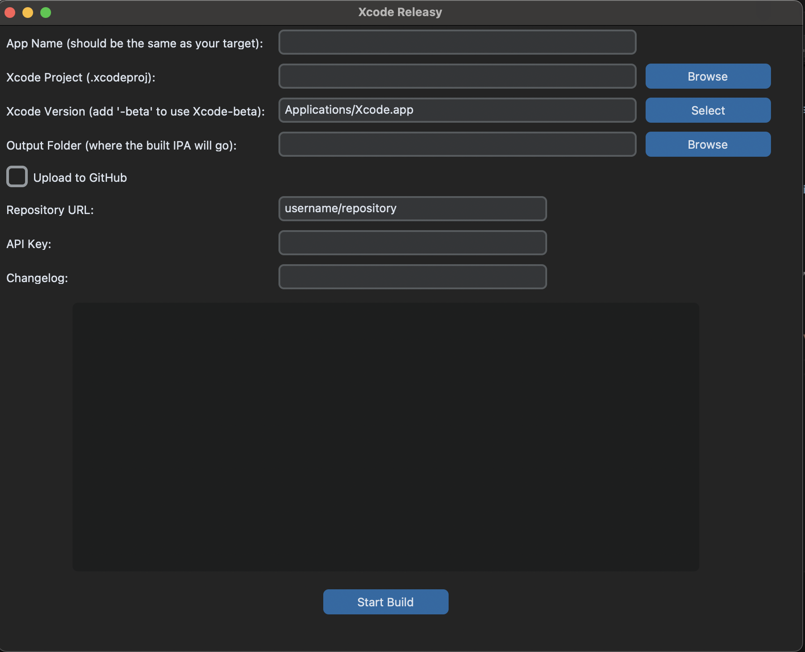

# Xcode-releasy

Xcode doesn't let free developer accounts generate IPA files to sideload onto iPhones for testing-- you can only install the app onto a device you own, and then use your singing capabilities for each instal. I didn't like this, as when developing GyroCam, I got beta feedback from my best friend and girlfriend who had the app on their phones and used Sideloadly to install it themselves the entire time every time I pushed an update.

Originally, I was manually creating the IPA files, but I got tired of this. I created a bash script to automate the process, and with a cherry on top, had it publish releases to GitHub for me, where my website had a script to automatically pull the latest release and download it straight from there. Today, I decided to rework this into a Python Tkinter app with a user interface. It is a pretty simple file, not much code, just one Python script. I may package it as an app as well, but if you wanna run it from the source yourself, just do:

```bash
bash pip3 install customtkinter requests
```

```bash 
curl -s https://raw.githubusercontent.com/fayaz12g/xcode-releasy/main/releasy.py | python3
```

And that's it. You'll have the program open and can use it to your heart's content. 
